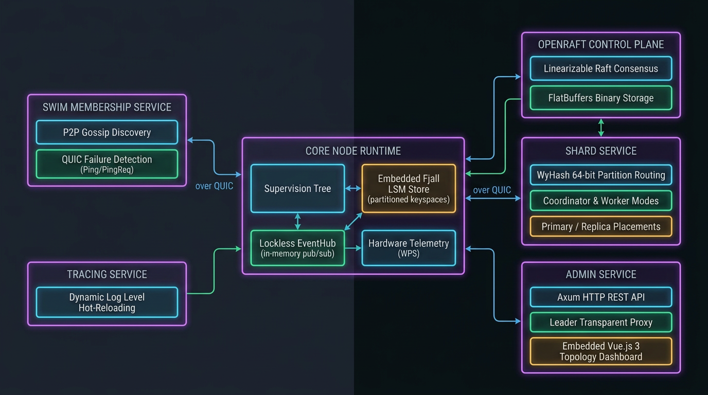

# Aaron

An opinionated, high-performance distributed systems runtime and actor-service framework in Rust, designed for resilient peer-to-peer (P2P) networking, embedded LSM-tree persistence, linearizable Raft consensus, lockless event-driven architecture, and supervised service lifecycles.

<details>
<summary><b>Origins & Vision (Click to expand)</b></summary>
<br>

> Aaron represents the culmination of **5 years of research, architectural experiments, and distributed systems engineering**. Not 5 years of experience but a decade of trying to build system that really work's as expected and scale well. I've written many docs, hand papers, diagrams on many tools, a lot of loc's trying make this work's very closest to the vision that I have in mind, to be honest maybe this version is a 52 version of the project but work's and look's very closest to what I thought. Bringing this such system is very difficult for a solo developer and that's why I used Gemini to build and maintain those pieces, but I try hard to architect it and put strong pattern decisions, perfect? not even close, but if you have something please open issue or contact me.

</details>

---

## Documentation Index

### Guides & Overview
- [1. Live Cluster Topology & Management Dashboard](#1-live-cluster-topology--management-dashboard)
- [2. Forming an Aaron Cluster in Rust](#2-forming-an-aaron-cluster-in-rust)
  - [Primary Coordinator & Admin Node (orders)](#1-primary-coordinator--admin-node-orders)
  - [Application Worker Node (inventory)](#2-application-worker-node-inventory)
  - [Implementing a Custom Domain Service](#3-implementing-a-custom-domain-service)
- [3. Architecture & Core Philosophy](#3-architecture--core-philosophy)
  - [System Architecture Overview](#system-architecture-overview)
  - [The 10 Opinionated Architectural Principles](#the-10-opinionated-architectural-principles)
- [4. Framework vs. User-Space Architectural Boundaries](#4-framework-vs-user-space-architectural-boundaries)
- [5. Workspace Structure](#5-workspace-structure)
- [6. Quick Start](#6-quick-start)

### Crate Specifications & Technical Reference
- [Node Architecture & Runtime Container Guide](./crates/node/README.md)
- [SWIM Membership Service & Protocol Specification](./crates/membership-service/README.md)
- [Control Plane Consensus Service Guide](./crates/control-plane-service/README.md)
- [Shard Service & Partitioning Roadmap](./crates/shard-service/README.md)
- [Admin Service & Vue.js Dashboard Guide](./crates/admin-service/README.md)
- [Tracing Service & Dynamic Reloading](./crates/tracing-service/README.md)
- [Architectural Conventions & Directives](./CONVENTIONS.md)

---

## 1. Live Cluster Topology & Management Dashboard

<p align="center">
  
</p>

<p align="center">
  This is the <a href="./crates/admin-service/README.md">Aaron Admin Dashboard</a>.
</p>

---

## 2. Forming an Aaron Cluster in Rust

Composing and launching distributed nodes in Aaron is concise, modular, and declarative. Cluster discovery, QUIC networking, and consensus addresses are driven automatically through standard environment variables (`MEMBERSHIP_SEEDS`, `MEMBERSHIP_BIND_ADDR`, etc.) or Kubernetes ConfigMaps without manual joining loops.

### 1. Primary Coordinator & Admin Node (orders)

The coordinator runs the OpenRaft consensus state machine, the shard placement coordinator, the embedded Vue.js admin dashboard (`http://127.0.0.1:8080`), and domain application services:

```rust
use aaron::{
    AdminService, ControlPlaneService, MembershipService, Node, ShardService, TracingService,
};

#[tokio::main]
pub async fn main() {
    let (membership_svc, membership_handle) = MembershipService::pair();
    let (control_svc, control_handle) = ControlPlaneService::pair();
    let (shard_svc, shard_handle) = ShardService::coordinator(control_handle.clone());

    Node::new("orders")
        .with(membership_svc)
        .with(
            AdminService::new()
                .with_membership_handle(membership_handle)
                .with_control_plane_handle(control_handle)
                .with_shard_handle(shard_handle),
        )
        .with(TracingService::new())
        .with(control_svc)
        .with(shard_svc)
        .with(OrderService)
        .run()
        .await
        .unwrap_or_else(|err| eprintln!("{err}"));
}
```

### 2. Application Worker Node (inventory)

Workers join the cluster mesh via SWIM gossip, receive partition assignments from the coordinator, and execute business logic:

```rust
use aaron::{MembershipService, Node, ShardService, TracingService};

#[tokio::main]
pub async fn main() {
    let (membership_svc, _membership_handle) = MembershipService::pair();
    let (shard_svc, shard_handle) = ShardService::worker();

    Node::new("inventory")
        .with(membership_svc)
        .with(TracingService::new())
        .with(shard_svc)
        .with(InventoryService::new(shard_handle))
        .run()
        .await
        .unwrap_or_else(|err| eprintln!("{err}"));
}
```

### 3. Implementing a Custom Domain Service

Any business logic can be packaged into a supervised `Service`. Services get direct access to the lockless `EventHub`, embedded LSM `Store`, and graceful cancellation tokens:

```rust
use aaron::{BoxError, Context, Service, ShardEvent, ShardHandle};
use tracing::info;

pub struct InventoryService {
    shard_handle: ShardHandle,
}

impl InventoryService {
    pub fn new(shard_handle: ShardHandle) -> Self {
        Self { shard_handle }
    }
}

impl Service for InventoryService {
    type Config = ();

    fn name(&self) -> &str {
        "inventory-service"
    }

    async fn run(&self, ctx: Context) -> Result<(), BoxError> {
        let node_id = ctx.identity.id();
        info!(%node_id, "Inventory service initialized");

        // React reactively to cluster and shard events over EventHub
        let mut shard_events = ctx.event_hub.subscribe::<ShardEvent>().await;

        loop {
            tokio::select! {
                _ = ctx.token.cancelled() => break,
                Ok(event) = shard_events.recv() => {
                    info!("Received shard assignment event: {event:?}");
                }
            }
        }
        Ok(())
    }
}
```

---

## 3. Architecture & Core Philosophy

### Comprehensive Multi-Service Runtime Architecture

<p align="center">
  
</p>

### The 10 Opinionated Architectural Principles

<details>
<summary><b>Click to expand the 10 core architectural principles of Aaron</b></summary>
<br>

Aaron is built upon 10 core architectural principles that dictate how distributed services are composed, configured, and operated:

1. **Decoupled, Composable Services (`Service`)**: Every capability (consensus, membership, sharding, admin, tracing) is an isolated, supervised service declaring its own capabilities, with the `Node` acting as runtime host.
2. **Fail-Fast Declarative Configuration (`ServiceConfig`)**: Services declare environment variables, types, and defaults upfront; the node validates schemas at boot before binding ports or opening storage.
3. **In-Memory Lockless Event Mesh (`EventHub`)**: In-process pub/sub over lockless ring buffers with typed topics, enabling high-throughput, non-blocking messaging across local services.
4. **Embedded Zero-External-Dependency Storage (`Store`)**: Embedded ACID LSM-tree engine (Fjall) partitioned into isolated keyspaces with striped mutexes for atomic Read-Modify-Write.
5. **Linearizable Consensus (`OpenRaft` & FlatBuffers)**: Cluster metadata and state machines replicate via OpenRaft with zero-copy FlatBuffers binary persistence in the local LSM.
6. **Deterministic WyHash Partitioning (`ShardService`)**: Uniform key distribution via 64-bit WyHash and Big-Endian partition prefixes (`[u16 BE Shard ID] + [Raw Key]`) for efficient LSM range scans.
7. **Hardware Micro-Benchmarking & Dynamic Telemetry**: Nodes benchmark CPU, RAM, and fsync at boot to establish nominal capacity, continuously tracking live Workload Performance Scores (WPS).
8. **Multiplexed Transport over QUIC (`Network`)**: Inter-node traffic runs over singleflight, connection-pooled QUIC streams with mutual P2P TLS authenticated against 128-bit node UUIDs.
9. **SWIM Cluster Membership & Failure Detection**: Decentralized peer discovery, direct Ping and indirect PingReq probes, and monotonic incarnation conflict resolution with automatic self-refutation.
10. **Erlang/OTP-Style Supervision Tree (`ServiceOpts`)**: Granular per-service lifecycle supervision with dedicated cancellation tokens, restart policies (`Never`, `Always`, `OnFailure`, `MaxRetries`), and backoff strategies.

</details>

---

## 4. Framework vs. User-Space Architectural Boundaries

Aaron provides the distributed infrastructure runtime. The boundary between the runtime framework and user-space domain logic is strictly delineated:

| Architectural Concern | Handled by Aaron (Framework Runtime) | Handled by User-Space (Application Domain) |
| :--- | :--- | :--- |
| **Node Lifecycle & Supervision** | Task supervision trees, backoff retry policies, and fail-fast environment validation. | Registering domain services and executing application business loops. |
| **P2P Transport & Mesh Security** | Multiplexed QUIC streams, connection pooling, and mutual P2P TLS certificate pinning. | Application-level protocols, user authentication (JWT/OAuth), and business endpoints. |
| **Cluster Discovery & Health** | SWIM gossip protocol, Ping/PingReq failure detection, and self-refutation. | Reacting to cluster membership events to trigger business workflows. |
| **Metadata Consensus** | Linearizable OpenRaft consensus for cluster state and FlatBuffers LSM storage. | Designing application metadata schemas stored within the consensus log. |
| **Partition Routing & Topology** | WyHash key-to-shard mapping, partition allocation, and Big-Endian LSM prefixing. | **Data Replication**: Streaming partition data (via WAL, Raft, or CRDTs) across replicas. |
| **Shard Leadership Transitions** | Authoritative cluster registry for shard assignments, epochs, and replica placements. | **Role State Machine**: Electing partition leaders and reporting active roles to Control Plane. |
| **Local Data Persistence** | Embedded ACID LSM engine (Fjall) with keyspace isolation and atomic RMW mutexes. | Domain data schemas, secondary indexes, and transactional query semantics. |

---

## 5. Workspace Structure

```
aaron/
├── crates/
│   ├── node/                   # Core runtime host, Context, Supervision, Network, Store, EventHub, Error
│   ├── tracing-service/        # Structured JSON/Pretty logging with dynamic runtime level reload
│   ├── membership-service/     # SWIM cluster membership & failure detection over QUIC FlatBuffers
│   ├── control-plane-service/  # Linearizable OpenRaft 0.9 consensus engine with FlatBuffers LSM storage
│   ├── shard-service/          # Multi-service shard assignment, worker RPC, and LSM persistence
│   ├── admin-service/          # Supervised HTTP dashboard serving embedded Vue.js SPA & REST APIs
│   └── aaron/                  # Workspace facade re-exporting all core and service primitives
├── assets/                     # Architecture diagrams and UI preview screenshots
├── schemas/
│   ├── node.fbs                # FlatBuffers 128-bit UUID schema
│   ├── membership.fbs          # FlatBuffers binary membership & gossip schemas
│   ├── control_plane.fbs       # FlatBuffers Raft consensus, storage & shard command schemas
│   └── shard.fbs               # FlatBuffers multi-service shard placement storage schema
└── Cargo.toml                  # Workspace manifest
```

### Crate Highlights

- **[`node`](./crates/node/README.md)**: Core runtime container providing `Node`, `Context`, `Service`, `ServiceConfig`, `EventHub`, `Network`, `Store`, `HardwareBenchmark`, and unified `Error`/`ErrorKind`.
- **[`membership-service`](./crates/membership-service/README.md)**: SWIM-based cluster membership, failure detection (Ping + PingReq), hostname and capability tag dissemination over QUIC FlatBuffers.
- **[`control-plane-service`](./crates/control-plane-service/README.md)**: OpenRaft 0.9 distributed consensus, binary FlatBuffers storage in Fjall, shard command dispatching, and dynamic membership management.
- **[`shard-service`](./crates/shard-service/README.md)**: Distributed partitioning engine managing primary/replica shard allocations per service, deterministic WyHash 64-bit routing, Big-Endian LSM prefixing, one-time Raft bootstrap, and QUIC worker RPCs.
- **[`admin-service`](./crates/admin-service/README.md)**: Embedded Vue.js 3 single-page application, 2D Canvas interactive topology ring, shard management drawer, and REST management interface with follower-to-leader transparent proxying.
- **[`tracing-service`](./crates/tracing-service/README.md)**: Dynamic observability service reacting to `ChangeLogLevel` events via `EventHub` with zero process restarts.

---

## 6. Quick Start

### Running Examples

```bash
# 1. Minimal Worker Node
cargo run --example basic_node

# 2. Dynamic Log Level Reloading with TracingService
cargo run --example tracing_node

# 3. Cluster Membership with Admin Handle & SWIM Gossip
cargo run --example cluster_admin

# 4. Full Node with Embedded Vue.js Admin Dashboard & Raft Control Plane (http://127.0.0.1:8080)
cargo run --example admin_node
```

### Running Tests and Benchmarks

```bash
# Run all workspace unit, integration, chaos, and fuzz tests
cargo test --all-targets --release

# Run Shard Route WyHash benchmarks
cargo bench -p shard-service --bench route_bench

# Run EventHub Criterion 0.8 benchmarks
cargo bench -p node --bench event_hub_bench

# Run linter
cargo clippy --all-targets --release
```
