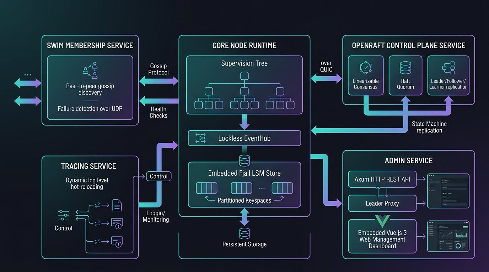
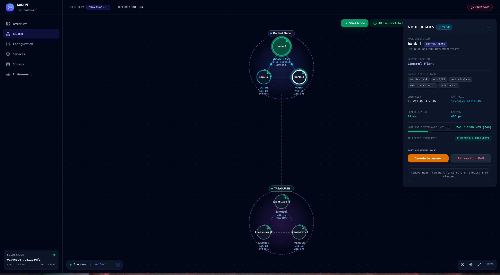

# Aaron

An opinionated, high-performance distributed systems runtime and actor-service framework in Rust, designed for resilient peer-to-peer (P2P) networking, embedded LSM-tree persistence, linearizable Raft consensus, lockless event-driven architecture, and supervised service lifecycles.

> **Origins & Vision**:
> Aaron represents the culmination of **5 years of research, architectural experiments, and distributed systems engineering**. Not 5 years of experience but a decade of trying to build system that really work's as expected and scale well. I've written many docs, hand papers, diagrams on many tools, a lot of loc's trying make this work's very closest to the vision that I have in mind, to be honest maybe this version is a 52 version of the project but work's and look's very closest to what I thought. Bringing this such system is very difficult for a solo developer and that's why I used Gemini to build and maintain those pieces, but I try hard to architect it and put strong pattern decisions, perfect? not even close, but if you have something please open issue or contact me.

---

## 1. The Opinionated Philosophy of Aaron

Aaron is built upon core architectural principles that dictate how distributed services should be composed, configured, and run:

1. **Decoupled, Composable Services (`Service` Trait)**:
   Every feature in Aaron (tracing, cluster membership, consensus, discovery, storage, shard routing, web administration) is a first-class, standalone, supervised `Service`. Services declare functional capabilities (`capabilities(&self) -> Vec<&str>`) such as `"control-plane"`, `"shard"`, or `"shard-worker"`, while the `Node` acts as a runtime host and supervisor.

2. **Fail-Fast Declarative Configuration (`ServiceConfig`)**:
   Services declare their environment variables, types, defaults, and descriptions explicitly. The node inspects and validates the entire configuration schema *before* initializing network listeners or opening disk storage. If a mandatory variable is missing or malformed, startup aborts immediately with actionable error reports.

3. **In-Memory Lockless Event Mesh (`EventHub`)**:
   Services communicate in-process using strongly-typed pub/sub events over lockless ring buffers ([`crossfire 3`](https://crates.io/crates/crossfire)), achieving multi-million events/sec throughput with zero global lock contention across distinct `TypeId` topics.

4. **Embedded Zero-External-Dependency Storage (`Store`)**:
   Every Aaron node comes with an embedded, ACID-compliant LSM-tree storage engine ([Fjall 3.1](https://crates.io/crates/fjall)) partitioned into isolated keyspaces (`"node"`, `"membership"`, `"control-plane"`, `"app"`). Features a 256-stripe mutex table for atomic Read-Modify-Write operations and explicit maintenance mode during snapshot swaps.

5. **Linearizable Distributed Consensus (`OpenRaft 0.9` & FlatBuffers)**:
   Cluster metadata replication and linearizable state machine consensus powered by OpenRaft. All on-disk consensus storage (`meta/vote`, `meta/membership`, `log/{:020index}`) is serialized into binary FlatBuffers schemas (`schemas/control_plane.fbs`), eliminating JSON overhead. Includes automated follower-to-leader HTTP request proxying.

6. **Multi-Service Shard Partitioning (`ShardService`)**:
   Distributed partition management supporting multi-service shard groups (`service_name`), one-time Raft bootstrap, manual shard assignment, topology rebalancing, and direct QUIC RPC commands to Data Plane workers.

7. **Hardware Micro-Benchmarking & Dynamic Telemetry (`NodeTelemetry`)**:
   During boot, the node executes a micro-benchmark ([`HardwareBenchmark`](crates/node/src/benchmark.rs)) measuring CPU ALU throughput (MOPS), RAM write bandwidth (MB/s), and disk fsync latency (µs) to calculate baseline nominal Workload Performance Score (WPS). Runtime telemetry continuously tracks live WPS and sliding error rates.

8. **Multiplexed Transport over QUIC (`Network`)**:
   All inter-node traffic travels over QUIC with native Web-of-Trust P2P TLS certificates authenticated against 128-bit node UUIDs, eliminating head-of-line blocking and connection handshake overhead with singleflight connection pooling.

9. **SWIM Cluster Membership & Failure Detection (`membership-service`)**:
   Decentralized peer discovery, direct `Ping` probes, indirect `PingReq` across $k$ intermediaries, monotonic incarnation conflict resolution with automatic self-refutation, and cluster token authorization (`MEMBERSHIP_CLUSTER_ID`).

10. **Erlang/OTP-Style Supervision Tree (`ServiceOpts`)**:
    Each service is isolated in its own task hierarchy with dedicated cancellation tokens, configurable restart policies (`Never`, `Always`, `OnFailure`, `MaxRetries`), and backoff strategies (`Constant`, `Linear`, `Exponential`).

---

## 2. Framework vs. User-Space Architectural Boundaries

Aaron is strictly an **infrastructure runtime and actor-service framework** for building distributed systems, not an out-of-the-box turnkey database. Its boundaries are explicitly delineated:

| Architectural Concern | Handled by Aaron (Framework Runtime) | Handled by User-Space (Application Domain) |
| :--- | :--- | :--- |
| **Node Lifecycle & Supervision** | OTP-style task isolation, restart policies, backoff timers, cancellation tokens, schema-based fail-fast env validation. | Defining domain services, business worker loops, and registering them into the `Node` runtime. |
| **P2P Transport & Mesh Security** | Multiplexed QUIC streams, singleflight connection pooling, Web-of-Trust P2P identity verified via 128-bit UUID SANs. | Application-level authentication and authorization (JWT, API keys, mTLS, RBAC) on business endpoints. |
| **Node Discovery & Health** | SWIM gossip protocol, direct `Ping`, indirect `PingReq`, incarnation conflict resolution, false-suspicion self-refutation. | Reacting to node join/leave/dead events to execute domain-specific workflows. |
| **Metadata Consensus** | Linearizable OpenRaft consensus for cluster state, joint consensus membership changes, zero-copy FlatBuffers LSM persistence, bounded chunked snapshot sync. | Deciding what cluster-wide metadata schemas your application stores in Raft. |
| **Partition Topology & Routing** | Deterministic route calculation via WyHash 64-bit (`wyhash_64(key, 0) % total_shards`), Big-Endian LSM prefixing (`[u16 BE Shard ID] + [Raw Key]`), multi-service shard assignment, and QUIC command dispatching. | **Data Replication**: Replicating application state across partition replicas (via local Raft, WAL streams, CRDTs, or event sourcing). |
| **Shard Leadership & Role Feedback** | Authoritative cluster-wide registry of shard assignments, epochs, and replica placements. | **Role State Machine**: Electing or transitioning partition roles within the worker nodes and reporting authoritative role state back to the Control Plane. |
| **Data Persistence** | Embedded ACID LSM-tree engine (Fjall) with keyspace isolation and 256 striped mutexes for atomic Read-Modify-Write. | Data modeling, indexing, transactions, serialization formats, and query semantics. |

---

## 3. Runtime Architecture & Management

### Comprehensive Multi-Service Runtime Architecture

<p align="center">
  
</p>

### Embedded Web Admin Dashboard & Live Topology

<p align="center">
  
</p>

The embedded Vue.js 3 dashboard (`admin-service`) is compiled directly into the binary via `rust-embed` and provides:
- **Interactive 2D Canvas Ring Topology**: Real-time visualization of cluster nodes with camera Pan & Zoom, smooth physics, and animated particle streams for SWIM gossip, Raft replication, and shard traffic.
- **Raft Consensus Control**: 1-click bootstrap, learner synchronization, voter promotion, and clean node expulsion (`RemoveNodes`).
- **Distributed Shards Console**: Search, filter by service name, edit primary/replica placements, and execute cluster bootstrap with support for up to 65,536 partitions under deterministic WyHash 64-bit routing.
- **Live Node Telemetry**: Real-time display of Workload Performance Scores (WPS), nominal capacities, and sliding error rates.
- **Fault Simulation Sandbox**: Interactive testing sandbox to inject node load, partition networks, and watch live shard failover animations.
- **LSM Storage Explorer**: Browse keyspaces, inspect raw/JSON data, and run batch read/write throughput benchmarks.

---

## 4. Expressive Cluster Composition in Rust

Spinning up a secure, supervised node with embedded storage, dynamic logging, SWIM gossip, Raft consensus, and an embedded Vue.js dashboard:

```rust
use aaron::{
    AdminService, ControlPlaneService, MembershipService, Node, ShardService, TracingService,
};
use std::time::Duration;

#[tokio::main]
async fn main() -> Result<(), node::BoxError> {
    // 1. Initialize services and operational handles
    let (membership_svc, membership_handle) = MembershipService::pair();
    let (control_plane_svc, cp_handle) = ControlPlaneService::pair();
    let (shard_svc, shard_handle) = ShardService::coordinator(cp_handle.clone());
    let tracing_svc = TracingService::new();

    let admin_svc = AdminService::new()
        .with_membership_handle(membership_handle.clone())
        .with_control_plane_handle(cp_handle.clone())
        .with_shard_handle(shard_handle.clone())
        .with_service_schema(&membership_svc)
        .with_service_schema(&control_plane_svc)
        .with_service_schema(&tracing_svc);

    // 2. Compose the Node runtime with service identity and supervised services
    let node = Node::new("bank")
        .with_tag("role:control-plane")
        .with(tracing_svc)
        .with(membership_svc)
        .with(control_plane_svc)
        .with(shard_svc)
        .with(admin_svc);

    // 3. Connect to the cluster seed asynchronously
    tokio::spawn(async move {
        tokio::time::sleep(Duration::from_millis(100)).await;
        let seed_addr = "127.0.0.1:7946".parse().unwrap();
        match membership_handle.join(seed_addr).await {
            Ok(peers) => println!("Joined cluster! Discovered {} peer(s)", peers.len()),
            Err(err) => eprintln!("Failed to join cluster: {err}"),
        }
    });

    // 4. Run the supervised node runtime
    node.run().await
}
```

---

## 5. Workspace Structure

```
aaron/
├── crates/
│   ├── node/                   # Core runtime host, Context, Supervision, Network, Store, EventHub, Error
│   ├── tracing-service/        # Structured JSON/Pretty logging with dynamic runtime level reload
│   ├── membership-service/     # SWIM cluster membership & failure detection over QUIC FlatBuffers
│   ├── control-plane-service/  # Linearizable OpenRaft 0.9 consensus engine with FlatBuffers LSM storage
│   ├── shard-service/          # Multi-service shard assignment, worker RPC, and LSM persistence
│   ├── admin-service/          # Supervised HTTP dashboard serving embedded Vue.js SPA & REST APIs
│   └── aaron/                  # Workspace facade re-exporting all core and service primitives
├── assets/                     # Architecture diagrams and UI preview screenshots
├── schemas/
│   ├── node.fbs                # FlatBuffers 128-bit UUID schema
│   ├── membership.fbs          # FlatBuffers binary membership & gossip schemas
│   ├── control_plane.fbs       # FlatBuffers Raft consensus, storage & shard command schemas
│   └── shard.fbs               # FlatBuffers multi-service shard placement storage schema
└── Cargo.toml                  # Workspace manifest
```

### Crate Highlights

- **[`node`](./crates/node/README.md)**: Core runtime container providing `Node`, `Context`, `Service`, `ServiceConfig`, `EventHub`, `Network`, `Store`, `HardwareBenchmark`, and unified `Error`/`ErrorKind`.
- **[`membership-service`](./crates/membership-service/README.md)**: SWIM-based cluster membership, failure detection (Ping + PingReq), hostname and capability tag dissemination over QUIC FlatBuffers.
- **[`control-plane-service`](./crates/control-plane-service/README.md)**: OpenRaft 0.9 distributed consensus, binary FlatBuffers storage in Fjall, shard command dispatching, and dynamic membership management.
- **[`shard-service`](./crates/shard-service/README.md)**: Distributed partitioning engine managing primary/replica shard allocations per service, deterministic WyHash 64-bit routing, Big-Endian LSM prefixing, one-time Raft bootstrap, and QUIC worker RPCs.
- **[`admin-service`](./crates/admin-service/README.md)**: Embedded Vue.js 3 single-page application, 2D Canvas interactive topology ring, shard management drawer, and REST management interface with follower-to-leader transparent proxying.
- **[`tracing-service`](./crates/tracing-service/README.md)**: Dynamic observability service reacting to `ChangeLogLevel` events via `EventHub` with zero process restarts.

---

## 6. Quick Start

### Running Examples

```bash
# 1. Minimal Worker Node
cargo run --example basic_node

# 2. Dynamic Log Level Reloading with TracingService
cargo run --example tracing_node

# 3. Cluster Membership with Admin Handle & SWIM Gossip
cargo run --example cluster_admin

# 4. Full Node with Embedded Vue.js Admin Dashboard & Raft Control Plane (http://127.0.0.1:8080)
cargo run --example admin_node
```

### Running Tests and Benchmarks

```bash
# Run all workspace unit, integration, chaos, and fuzz tests
cargo test --all-targets --release

# Run EventHub Criterion 0.8 benchmarks
cargo bench -p node --bench event_hub_bench

# Run linter
cargo clippy --all-targets --release
```

---

## 7. Documentation Index

- [Node Architecture & Service Development Guide](./crates/node/README.md)
- [SWIM Membership Service & Protocol Specification](./crates/membership-service/README.md)
- [Control Plane Consensus Service Guide](./crates/control-plane-service/README.md)
- [Shard Service & Partitioning Roadmap](./crates/shard-service/README.md)
- [Admin Service & Vue.js Dashboard Guide](./crates/admin-service/README.md)
- [Tracing Service & Dynamic Reloading](./crates/tracing-service/README.md)
- [Architectural Conventions & Directives](./CONVENTIONS.md)
