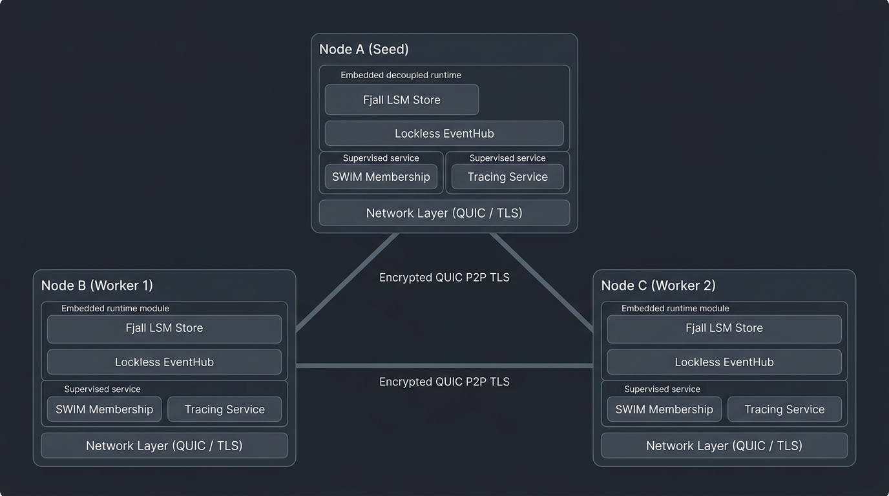

# Aaron

An opinionated, high-performance distributed systems runtime and actor-service framework in Rust, designed for resilient peer-to-peer (P2P) networking, embedded LSM-tree persistence, lockless event-driven architecture, and supervised service lifecycles.

> **Origins & Vision**:
> Aaron represents the culmination of **5 years of research, architectural experiments, and distributed systems engineering**. Not 5 years of experience but a decade of trying to build system that really work's as expected and scale well. I've written many docs, hand papers, diagrams on many tools, a lot of loc's trying make this work's very closest to the vision that I have in mind, to be honest maybe this version is a 52 version of the project but work's and look's very closest to what I thought. Bringing this such system is very difficult for a solo developer and that's why I used Gemini to build and maintain those pieces, but I try hard to architect it and put strong pattern decisions, perfect? not even close, but if you have something please open issue or contact me.

---

## 1. The Opinionated Philosophy of Aaron

Aaron is built upon core architectural principles that dictate how distributed services should be composed, configured, and run:

1. **Decoupled, Composable Services (`Service` Trait)**:
   Every feature in Aaron (tracing, cluster membership, discovery, storage, RPC) is a first-class, standalone, supervised `Service`. The `Node` acts as a runtime host and supervisor.

2. **Fail-Fast Declarative Configuration (`ServiceConfig`)**:
   Services declare their environment variables, types, defaults, and descriptions explicitly. The node inspects and validates the entire configuration schema *before* initializing network listeners or disk storage. If a mandatory variable is missing or malformed, startup aborts immediately with actionable error reports.

3. **In-Memory Lockless Event Mesh (`EventHub`)**:
   Services communicate in-process using strongly-typed pub/sub events over lockless ring buffers ([`crossfire 3`](https://crates.io/crates/crossfire)), achieving multi-million events/sec throughput with zero global lock contention across distinct topics.

4. **Embedded Zero-External-Dependency Storage (`Store`)**:
   Every Aaron node comes with an embedded, ACID-compliant LSM-tree storage engine ([Fjall 3.1](https://crates.io/crates/fjall)) partitioned into isolated keyspace namespaces (`node`, `membership`, `app`). Features striped atomic RMW locks and explicit maintenance mode during snapshot swaps.

5. **OpenDAL-Style Enriched Error Architecture (`Error`, `ErrorKind`, `snafu`)**:
   Strongly-typed error domains with context selectors powered by [`snafu 0.8`], unified into an OpenDAL-inspired `Error` struct providing structured `ErrorKind` classification, operation labeling, and key-value diagnostic context.

6. **Multiplexed Transport over QUIC (`Network`)**:
   All inter-node traffic travels over QUIC with native Web-of-Trust P2P TLS certificates authenticated against 128-bit node UUIDs, eliminating head-of-line blocking and connection handshake overhead.

7. **Erlang/OTP-Style Supervision Tree (`ServiceOpts`)**:
   Each service is isolated in its own task hierarchy with dedicated cancellation tokens, configurable restart policies (`Never`, `Always`, `OnFailure`, `MaxRetries`), and backoff strategies (`Constant`, `Linear`, `Exponential`).

---

## 2. Cluster Architecture in Action

<p align="center">
  
</p>

### Expressive Cluster Composition in Rust

Spinning up a secure, supervised node with embedded storage, dynamic logging, and cluster gossip takes just a few lines of idiomatic Rust:

```rust
use node::{Node, Context, service_fn};
use membership_service::{MembershipService, MembershipEvent};
use tracing_service::TracingService;
use std::time::Duration;

#[tokio::main]
async fn main() -> Result<(), node::Error> {
    // 1. Initialize Membership with an admin handle for cluster operations
    let (membership_svc, membership_handle) = MembershipService::new_with_handle();

    // 2. Compose the Node runtime with supervised services and event observers
    let node = Node::new()
        .with(TracingService::new())
        .with(membership_svc)
        .with(service_fn("cluster-watcher", |ctx: Context| async move {
            let mut sub = ctx.event_hub.subscribe::<MembershipEvent>().await;
            while let Ok(event) = sub.recv().await {
                println!("Cluster event observed: {event:?}");
            }
            Ok(())
        }));

    // 3. Connect to the cluster seed asynchronously
    tokio::spawn(async move {
        tokio::time::sleep(Duration::from_millis(100)).await;
        let seed_addr = "127.0.0.1:9001".parse().unwrap();
        match membership_handle.join(seed_addr).await {
            Ok(peers) => println!("Joined cluster! Discovered {} peer(s)", peers.len()),
            Err(err) => eprintln!("Failed to join cluster: {err}"),
        }
    });

    // 4. Run the supervised node runtime
    node.run().await
}
```

---

## 3. Workspace Structure

```
aaron/
├── crates/
│   ├── node/                   # Core runtime host, Context, Supervision, Network, Store, EventHub, Error
│   ├── tracing-service/        # Structured JSON/Pretty logging with dynamic runtime level reload
│   └── membership-service/     # SWIM cluster membership & failure detection over QUIC FlatBuffers
├── schemas/
│   └── membership.fbs          # FlatBuffers binary protocol definitions
└── Cargo.toml                  # Workspace manifest
```

### Crate Highlights

- **[`node`](./crates/node/README.md)**: Core runtime container providing `Node`, `Context`, `Service`, `ServiceConfig`, `EventHub`, `Network`, `Store`, and unified `Error`/`ErrorKind`.
- **[`tracing-service`](./crates/tracing-service/README.md)**: Dynamic observability service reacting to `ChangeLogLevel` events via `EventHub`.
- **[`membership-service`](./crates/membership-service/README.md)**: SWIM-based cluster membership, failure detection (Ping + PingReq), and gossip dissemination over QUIC with strict `cluster_id` authorization.

---

## 4. Quick Start

### Running the Examples

Aaron includes ready-to-run examples demonstrating the framework's capabilities:

```bash
# 1. Minimal Worker Node
cargo run --example basic_node

# 2. Dynamic Log Level Reloading with TracingService
cargo run --example tracing_node

# 3. Cluster Membership with Admin Handle & SWIM Gossip
cargo run --example cluster_admin
```

### Running Tests and Benchmarks

```bash
# Run all workspace unit, integration, chaos, and fuzz tests
cargo test --all-targets --release

# Run EventHub Criterion 0.8 benchmarks
cargo bench -p node --bench event_hub_bench

# Run linter
cargo clippy --all-targets --release
```

---

## 5. Documentation Index

- [Node Architecture & Service Development Guide](./crates/node/README.md)
- [SWIM Membership Service & Protocol Specification](./crates/membership-service/README.md)
- [Tracing Service & Dynamic Reloading](./crates/tracing-service/README.md)
- [Architectural Conventions & Directives](./CONVENTIONS.md)
