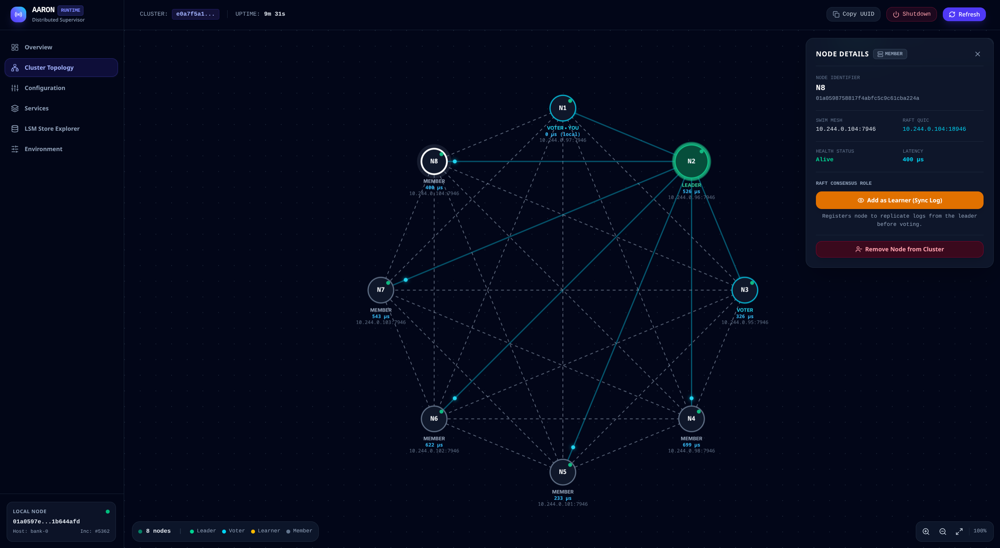

# Admin Service (`admin-service`)

A supervised HTTP management service for the Aaron distributed runtime that embeds and serves a high-performance Vue.js 3 single-page application (SPA) alongside REST and Server-Sent Events (SSE) administration APIs.

---

## 1. Dashboard Overview

<p align="center">
  
</p>

---

## 2. Capabilities & Architecture

- **Zero-External-Asset Runtime**: Compiles and embeds the Vue.js 3 SPA directly into the Rust binary with `rust-embed`. Aaron nodes serve the complete visual dashboard without requiring external frontend servers or static directories.
- **Interactive Canvas 2D Topology Ring**: Real-time visual monitoring of cluster members (Alive, Suspect, Dead) with physics-based smooth node movement, latency display, and dashed SWIM gossip communication links.
- **OpenRaft Consensus Management**: 
  - Visual distinction of node roles (**Leader**, **Voter**, **Learner**, **Member**).
  - 1-Click Bootstrap and full Raft lifecycle actions (**Add as Learner**, **Promote to Voter**, **Demote to Learner**, **Remove from Raft**).
  - Transparent HTTP proxying from followers to the active Raft leader.
- **100% String-Safe UUID API**: Operates strictly on 128-bit hexadecimal String UUIDs, preventing precision loss in JavaScript and foreign clients.
- **LSM-Tree Key-Value Explorer & Benchmarking**: Browse partitioned keyspaces (`"node"`, `"membership"`, `"control-plane"`, `"app"`), scan with prefix filtering, inspect formatted JSON and binary hex payloads, insert/delete keys, and execute high-throughput batch write/read benchmarks.
- **Dynamic Log Filter Reloading**: Apply new `EnvFilter` tracing directives dynamically on-the-fly (via `EventHub`), with real-time log and event streaming over Server-Sent Events (SSE).
- **Supervised Services Introspection**: Inspect registered services, declared configuration schemas (`ServiceConfig`), expected types, defaults, and currently resolved environment variables.
- **Environment & Secret Detection**: Inspect active environment variables with automated masking of sensitive secrets (tokens, keys, passwords).

---

## 3. Configuration (`AdminConfig`)

Declared configuration variables validated before startup:

| Environment Variable | Type | Default | Description |
|----------------------|------|---------|-------------|
| `ADMIN_BIND_ADDR` | `SocketAddr` | `127.0.0.1:8080` | HTTP address and port for the dashboard and REST API |
| `ADMIN_ENABLED` | `bool` | `true` | Enables or disables the HTTP admin dashboard service |
| `ADMIN_STATIC_DIR` | `String` | `None` | Optional filesystem directory for external static frontend assets |

---

## 4. REST API Reference

### Cluster & Membership
| Method | Endpoint | Description |
|--------|----------|-------------|
| `GET` | `/api/health` | Health check endpoint returning node status and uptime |
| `GET` | `/api/node` | Local node identity, hardware, and network interfaces |
| `GET` | `/api/cluster` | Cluster authority ID, local member, and member topology list |
| `POST` | `/api/cluster/join` | Connect to a cluster seed (`{ "seed": "127.0.0.1:17946" }`) |
| `POST` | `/api/cluster/leave` | Gracefully broadcast voluntary `Left` status |
| `POST` | `/api/cluster/nodes/start` | Emit node scale/start event to `EventHub` |
| `POST` | `/api/cluster/nodes/remove` | Mark a SWIM node dead and remove from cluster table |

### Raft Control Plane Consensus
| Method | Endpoint | Description |
|--------|----------|-------------|
| `GET` | `/api/control-plane/status` | Current term, leader UUID, voters, learners, and state map |
| `POST` | `/api/control-plane/init` | Bootstrap Raft cluster with initial voters (`{ "voters": [...] }`) |
| `POST` | `/api/control-plane/membership` | Update voter quorum with joint consensus |
| `POST` | `/api/control-plane/learner` | Add a non-voting replica learner (`{ "uuid": "...", "addr": "..." }`) |
| `POST` | `/api/control-plane/remove-node` | Expurgate a node replica completely from Raft (`{ "uuid": "..." }`) |
| `POST` | `/api/control-plane/state` | Execute linearizable write on Raft leader (`{ "key": "...", "value": "..." }`) |
| `DELETE` | `/api/control-plane/state` | Execute linearizable delete on Raft leader (`{ "key": "..." }`) |

### LSM Store Explorer & Benchmarks
| Method | Endpoint | Description |
|--------|----------|-------------|
| `GET` | `/api/store` | LSM store filesystem path, keyspaces, and maintenance status |
| `POST` | `/api/store/keyspaces` | Initialize a new keyspace (`{ "name": "app" }`) |
| `GET` | `/api/store/:keyspace/scan` | Paginated prefix scan (`?prefix=...&limit=50`) |
| `GET` | `/api/store/:keyspace/get` | Retrieve key value (`?key=...`) |
| `POST` | `/api/store/:keyspace/set` | Insert or update key value (`{ "key": "...", "value": "..." }`) |
| `DELETE` | `/api/store/:keyspace/delete` | Delete key (`?key=...`) |
| `POST` | `/api/store/benchmark` | Run batch write/read LSM benchmark (`{ "keyspace": "app", "count": 1000 }`) |

### Services, Logging & Environment
| Method | Endpoint | Description |
|--------|----------|-------------|
| `GET` | `/api/services` | Supervised services and their `ServiceConfig` schemas |
| `GET` | `/api/tracing` | Retrieve active log level filter directive |
| `POST` | `/api/tracing/level` | Dynamically update log filter (`{ "filter": "debug" }`) |
| `GET` | `/api/env` | Active environment variables with secret masking |

---

## 5. Usage Example

```rust
use aaron::{AdminService, MembershipService, ControlPlaneService, TracingService, Node};

#[tokio::main]
async fn main() -> Result<(), node::Error> {
    let (membership, m_handle) = MembershipService::pair();
    let (control_plane, cp_handle) = ControlPlaneService::new_with_handle();
    let tracing = TracingService::new();

    let admin = AdminService::new()
        .with_membership_handle(m_handle)
        .with_control_plane_handle(cp_handle)
        .with_service_schema(&membership)
        .with_service_schema(&control_plane)
        .with_service_schema(&tracing);

    Node::new()
        .with(tracing)
        .with(membership)
        .with(control_plane)
        .with(admin)
        .run()
        .await
        .map_err(Into::into)
}
```
