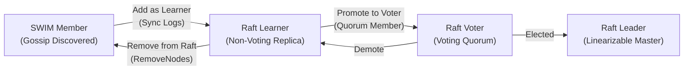

# Control Plane Service (`control-plane-service`)

A high-performance, linearizable distributed consensus engine for the Aaron runtime built on top of [`OpenRaft 0.9`](https://crates.io/crates/openraft), embedded [`Fjall 3.1`](https://crates.io/crates/fjall) LSM storage, and multiplexed QUIC transport.

---

## 1. Overview & Architectural Capabilities

The **Control Plane Service** provides strongly consistent coordination, cluster-wide metadata replication, and linearizable distributed state management:

- **OpenRaft 0.9 Consensus Core**: Full implementation of the Raft distributed consensus protocol, supporting joint consensus dynamic membership transitions, leader election, and non-voting learners.
- **Embedded LSM-Tree Storage Engine**: Persistent log entries, cluster votes, and replicated state machine data backed by an isolated `"control-plane"` keyspace in Fjall.
- **Multiplexed QUIC Transport**: Low-latency inter-node communication with peer-to-peer TLS authentication, stream-level framing, and connection caching.
- **Dynamic Topology Routing**: Integrates with SWIM membership to resolve live peer IP addresses dynamically, surviving Kubernetes pod restarts and network migrations.
- **100% String-Safe UUIDs**: Operates on full 128-bit node UUIDs (`node::Uuid`), eliminating 64-bit integer truncation in HTTP and cross-language boundaries.

---

## 2. Cluster State Machine & Role Lifecycle

Nodes progress through a strict, deterministic Raft consensus lifecycle:



1. **`Member`**: Discovered by the SWIM gossip mesh; does not participate in Raft consensus.
2. **`Learner`**: Registers with the active Raft leader to receive log replication and synchronize its state machine without voting rights.
3. **`Voter`**: Promoted into the voting quorum via joint consensus (`ChangeMembership`).
4. **`Leader`**: Elected by majority quorum to serve linearizable writes and coordinate log replication.

---

## 3. Configuration (`ControlPlaneConfig`)

Declared configuration variables validated at node startup:

| Environment Variable | Type | Default | Description |
|----------------------|------|---------|-------------|
| `CONTROL_PLANE_BIND_ADDR` | `SocketAddr` | `0.0.0.0:18946` | QUIC address and port for Raft consensus RPCs |
| `CONTROL_PLANE_ENABLED` | `bool` | `true` | Enables or disables the Control Plane consensus service |
| `CONTROL_PLANE_KEYSPACE` | `String` | `"control-plane"` | Name of the embedded LSM keyspace for log and state storage |
| `CONTROL_PLANE_HEARTBEAT_INTERVAL_MS` | `u64` | `50` | Leader heartbeat interval in milliseconds |
| `CONTROL_PLANE_ELECTION_TIMEOUT_MIN_MS` | `u64` | `150` | Minimum election timeout in milliseconds |
| `CONTROL_PLANE_ELECTION_TIMEOUT_MAX_MS` | `u64` | `300` | Maximum election timeout in milliseconds |

---

## 4. LSM Storage Layout (`ControlPlaneStorage`)

Data is persisted in the `"control-plane"` keyspace using lexicographically ordered binary keys:

```
meta/vote              -> [term: u64][node_id: u64][is_committed: u8]
meta/last_purged       -> [term: u64][index: u64]
log/{:020index}        -> [term: u64][index: u64][len: u32][payload_bytes]
data/{key}             -> [value_bytes]
```

- **`meta/vote`**: Tracks the current term and voted-for candidate to prevent split-brain elections across node restarts.
- **`log/{:020}`**: Fixed-width 20-digit zero-padded log keys ensure fast range scans and ordered iteration during replay.
- **`data/{key}`**: The replicated state machine key-value store, committed only upon quorum agreement.

---

## 5. Rust Usage Example

```rust
use aaron::{ControlPlaneService, Node, Context};
use std::time::Duration;

#[tokio::main]
async fn main() -> Result<(), node::Error> {
    let (cp_svc, cp_handle) = ControlPlaneService::new_with_handle();

    let node = Node::new()
        .with(cp_svc);

    tokio::spawn(async move {
        tokio::time::sleep(Duration::from_millis(500)).await;
        
        // Check leadership and execute linearizable writes
        if cp_handle.is_leader() {
            let _ = cp_handle.set("cluster/config/version", "2.1.0").await;
            println!("Configuration updated through Raft leader!");
        }
    });

    node.run().await
}
```
